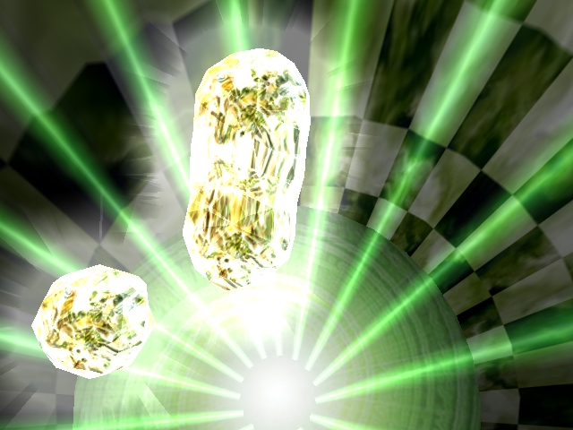

Optical
=========

**Optical** is a demo by Polish demoscene group Addict released at Mekka&Symposium 2001 in Germany. The code in this repository mostly corresponds to what was shown at the party. I did not grasp the concept of source control back then, so I can't guarantee that it is exatly what was shown :)

The code is released only as a reference for anyone curious left out there. I was ~19-20 years old when coding this demo, learning both Win32 API and OpenGL API in the process. Obviously back then I had zero exposure to software engineering good practices, OOP and so on. What you can see is "get this shit to work" type of code, so read at your own risk.

OpenGL version used was 1.x, so it is fixed piepeline, extremely extension heavy, with a lot vendor specific extensions. The mess in this repo is one of the reasons I switched to Direct3D later. Today, OpenGL rendering layer could be done in much, much simpler way without all the vendor extension mess. I am still thinking of actually doing it one day :)

The demo was directly loading Lightwave 5.x scene/object files, and interpreting Lightwave surfaces directly. Same goes for texture coordinate generation, and motion interpolation algorithms (which I think were even taken from NewTek SDK).

Per pixel lighting using NV_register_combiners extension was based on research paper published by NVIDIA.

Optical on pouet.net - http://www.pouet.net/prod.php?which=3018. Pouet.net has link to download party version (not recommended) and to youtube video done by my friend.

To download final version click this link - http://www.maciejmroz.com/optical_f.zip. It has with a lot of bugs fixed and hq soudtrack. Some of the effects work on NVIDIA hardware only.

